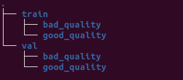
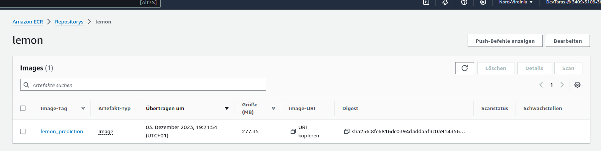
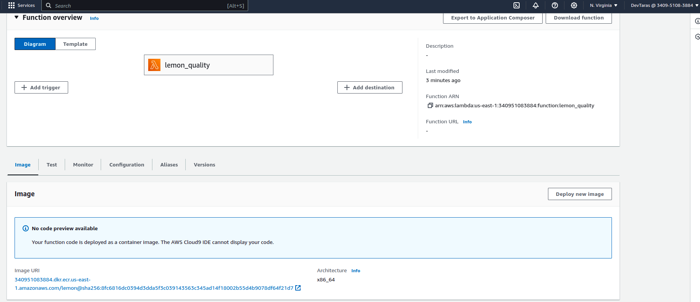
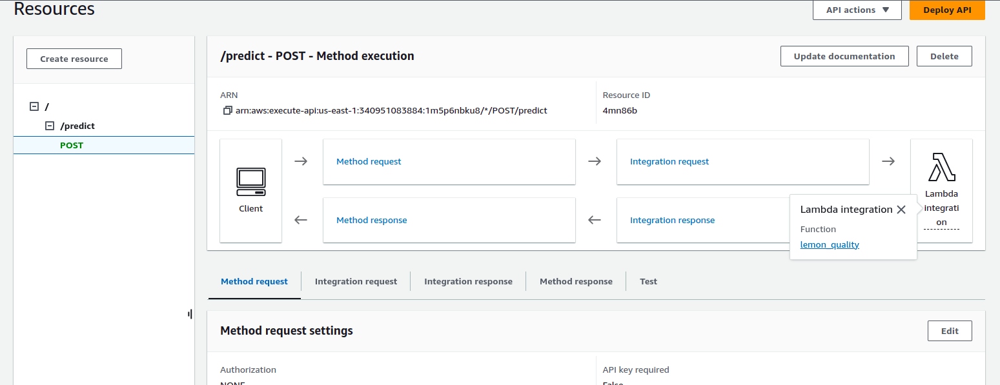
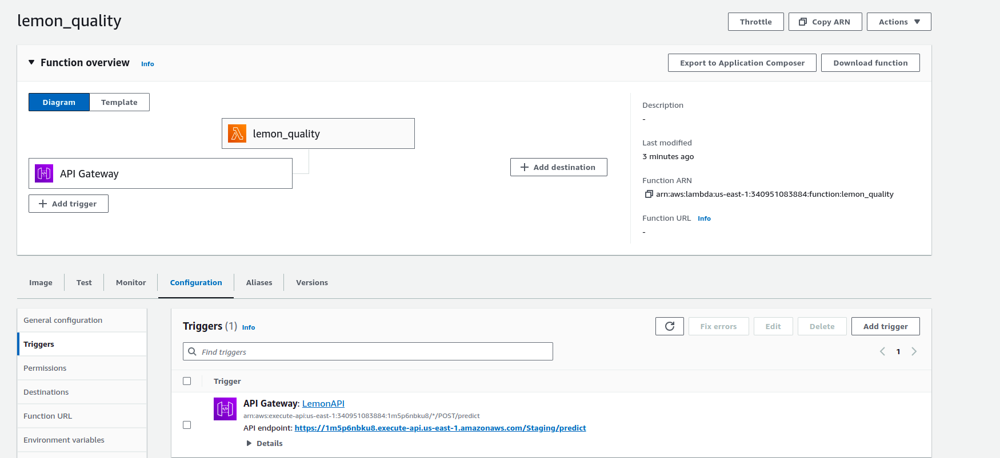
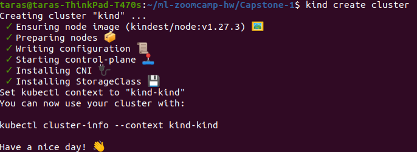
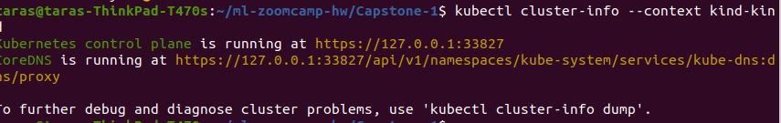
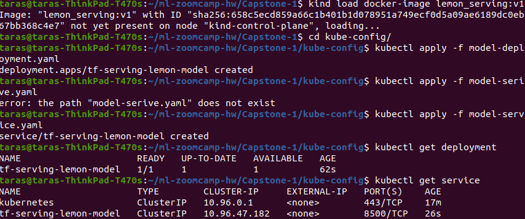
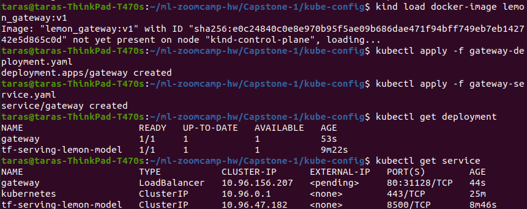

This project is devoted to the estimation of a lemon's quality (whether the lemon is spoiled or not) based on a photo of
the lemon.

The dataset used originates from https://www.kaggle.com/datasets/yusufemir/lemon-quality-dataset/data

It contains 300x300 p. 2.533 images (300 x 300 pixels), that are taken on a concrete surface. Dataset also includes
empty images of this surface.
Naturally the dataset contains images of both bad and good quality lemons under slightly different lighting conditions (
all under daylight) and sizes.
The aim is to classify a lemon, whether it is of a good or a bad quality.

# Structure of the project
    ├── README.md               <- The top-level README.
    ├── Pipfile                 <- project libraries requirements.
    ├── Pipfile.lock            <- file that defines dependency tree.
    ├── Dockerfile              <- Docker file for a lambda function
    ├── image-gateway.dockerfile <- Docker file for a gateway service
    ├── image-model.dockerfile   <- Docker file for a prediction service using tesnorflow serving.
    ├── docker-compose.yaml      <- Docker compose for gateway and prediction service.
    ├── download_models.sh       <- bash script to download models (large files) from s3 bucket.
    ├── src
    │   ├── gateway.py            <- Flask gateway application code.
    │   ├── lambda_function.py    <- lambda function code.
    │   ├── proto.py              <- module for dealing with proto functionaliyty.
    │   ├── utils                 <- utils module (transforming to saved, tffile models) 
    ├── testing_scripts
    │   ├── testing_endpoint.py         <- script to test differnet endpoints.
    │   
    │
    ├── models                           <- folder with ML models (filled by download_models.sh) and train_final_lemon_model.py.
    ├── kube_config                      <- folder with k8s services/deployments yaml.
    ├── gateway_dependencies             <- Pipfile for gateway service.   
    ├── screenshots                      <- screenshots evidences for lambda function, k8s deployments etc.
    │
    ├── notebooks                        <-  contains Jupyter notebook for investigation of different NNs.


1. The notebook lemon_model.ipynb is devoted to the finding a suitable TF model.
2. After this model is transformed to tensorlite model (using <code>transform_to_tlite.py</code>)
3. And deployed as an AWS Lambda with Docker container image (previously pushed to ECR), see <code>
   lambda_function.py</code> and <code>Dockerfile</code>.
4. The model is transformed into Tensor-formatted form (see lemon_saved folder) using <code>
   src/utils/convert_to_saved_model_format.py</code>
5. Moreover, the model is deployed locally using <code>docker compose</code>, as well as on a k8s cluster (refer to the
   content of <code>kube-config</code> folder).
6. Deployment to k8s is defined in <code>kube-config</code> folder.

# Preliminaries

0. Clone the current repository and go to Capstone-1 folder.
1. Download kaggle dataset from an URL: https://www.kaggle.com/datasets/yusufemir/lemon-quality-dataset/data.
2. To transform kaggle dataset structure to a structure suitable for <code>ImageDataGenerator</code>, create a folder
   with the following structure:



and apply script <code>src/utils/to_train_val.py</code> as the following:

```bash
python to_train_val.py --path_to_dataset "path to the top level of kaggle lemon_dataset" --path_to_output_directory "path to output directory"
```

4. Download all models from S3-Bucket by going to source directory and executing

```bash
bash download_models.sh
```

## Activating environment. Running jupyter notebook

It is assumed that <code>python 3.10.*</code> is installed (probably it should work for another versions).

1. Go to the root folder and execute the following

```bash
pipenv install --dev
pipenv shell
```

2. In order to use the kernel of this environment in a jupyter notebook execute

```bash
python -m ipykernel install --user --name=lemon
```

3. Go to <code>notebooks</code> and open the <code>lemon_model.ipynb</code> with jupyter.

## Local Deployment using <code>docker compose</code>

It is assumed that docker as well docker compose have been installed. The project has been cloned, we are in the folder
_Capstone-1_.

1. Build <code>tf-serving</code> container that includes the lemon model:

```bash
docker build -t lemon_serving:v1 -f image-model.dockerfile .
```

2. Build <code>gateway</code> container with the corresponding Flask-application:

```bash
docker build -t lemon_gateway:v1 -f image-gateway.dockerfile .
```

3. Start <code>docker compose</code> (consider _docker-compose.yaml_):

```bash
docker compose up
```

## Deployment using AWS Lambda

Assuming that we are in the _Capstone-1_ repository.

1. Build lambda function docker container:

```bash
docker build -t lemon_prediction .
```

2. Create ECR repository, log in there and push the container there.

```bash
aws ecr create-repository --repository-name lemon
aws ecr get-login
$(aws ecr get-login --no-include-email)
#after creating a repository we ge the URI of the registry, it looks as the following
PREFIX=340951083884.dkr.ecr.us-east-1.amazonaws.com/lemon
# tag lemon_prediction
docker tag lemon_prediction ${PREFIX}:lemon_prediction
docker push 
```



3. Create the lambda function using AWS Console (standard way):
   
4. Create API Gateway for the lambda function:
   
5. The final scheme of lambda function looks as the following:
   

## Deployment on k8s cluster

It is assumed that _kind_ and _kubectl_ have been installed, moreover the containers _lemon_gateway:v1_, _lemon_serving:
v1_ (defined respectively by _image-gateway.dockerfile_ and _image-model.dockerfile_) have been built.

1. Create a cluster using kind

```bash
kind create cluster
```


The cluster information is as the following


2. To deploy tf-serving go to _kube-config_ directory, load _lemon_serving:v1_ container to cluster and start
   _tf-serving_ deployment and service:

```bash
kind load docker--iamge lemon_serving:v1
kubectl apply -f model-deployment.yaml
kubectl apply -f model-service.yaml
```

and verify that deployment was successfully:

```bash
kubectl get deployment
kubectl get service
```



3. To deploy gateway go to _kube-config_ directory, load _lemon_gateway:v1_ container to cluster and start _gateway_
   deployment and service:

```bash
kubectl apply -f gateway-deployment.yaml
kubectl apply -f gateway-service.yaml
```

and verify that deployment was successfully:

```bash
kubectl get deployment
kubectl get service
```



4. To test the complete deployment forward a port

```bash
kubectl port-forward service/gateway 8080:80
```

and run <code> testing_scripts/test_endpoint.py</code> with <code>gateway_url</code> (8080/predict)
with different images (please note that some images can be ).

## Training

To train a final model go to <code>models</code> folder and execute <code>python train_final_lemon_model.py
--path_to_lemon_dataset PATH_TO_LEMON_DATASET</code>

## Testing
Go to <code>testing_scripts/test_endpoint.py</code>. There are 3 urls for testing:
* url - url for a local testing of a lambda function
* gateway_url  - url for predict endpoint on 8080 port (can be used for testing k8s deployment)
* gateway_lambda_ur - url for gateway for a lambda function on amazon, this service will be alive the next few weeks.

There are 5 test data images that are found on a Google Photos service:
* data1 - a photo of a rose 
* good_lemon_1 - a photo of a good lemon
* good_lemon_2 - a photo of a good lemon
* bad_lemon_1 - a photo of a bad lemon
* bad_lemon_2 - a photo of a bad lemon

<code>request</code> library is used to send requests.